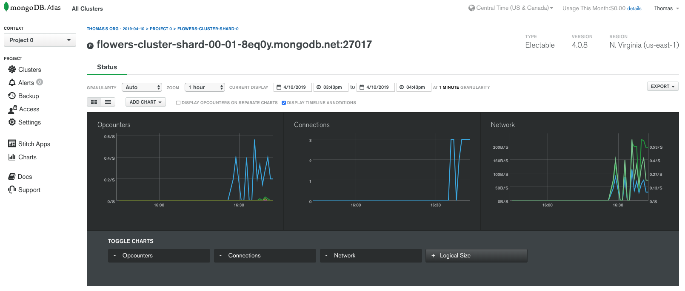

# FlowersApp

The FlowersApp is a simple CRUD Angular App that connects to a Mongo database. It is an exercise in following best practices used in modern, professional development teams.

This project was generated with [Angular CLI](https://github.com/angular/angular-cli) version 7.2.2.

## Best Practices

This project uses the following practices:

- Version control *committing early and often!*
- Continuous integration
  - Whenever code is pushed to github, TravisCI is configured to run an automated build, lint, and test
- Trunk-based development
- **Test Driven Development**
  - Using Karma
  - Using Mocha (JavaScript testing framework) and Chai (assertion library) for isolated MongoDB tests
  - Tests can be run extremely frequently and reliably
- Loosely coupled architecture
  - There is an abstraction layer between the database and the UI

## Up and Running

Serve the Mongo Database by using the command `mongod`

In a new terminal, run `ng serve` for a dev server. Navigate to `http://localhost:4200/`. The app will automatically reload if you change any of the source files.

In a new terminal, run `ng test` to execute the unit tests via [Karma](https://karma-runner.github.io).

In a new terminal, run `npm run mocha` to run the database test suite that listens for changes.

In a new terminal, run `npm run backend-server` to serve the API layer that listens for changes.

## Build

Run `ng build` to build the project. The build artifacts will be stored in the `dist/` directory. Use the `--prod` flag for a production build.

## Running unit tests

Run `ng test` to execute the unit tests via [Karma](https://karma-runner.github.io).

## The Database

Mongo Atlas is Mongo's cloud database. The Flowers database is managed through Mongo Atlas and hosted on AWS. 

*Mongo Atlas has interesting analytics about the usage of the used database*

### Mongoose

The Mongo client used is *Mongoose*, which provides a straight-forward, schema-based solution to model application data. It includes built-in type casting, validation, query building, business logic hooks and more, out of the box.

## Running end-to-end tests

Run `ng e2e` to execute the end-to-end tests via [Protractor](http://www.protractortest.org/).

## Further help

To get more help on the Angular CLI use `ng help` or go check out the [Angular CLI README](https://github.com/angular/angular-cli/blob/master/README.md).
